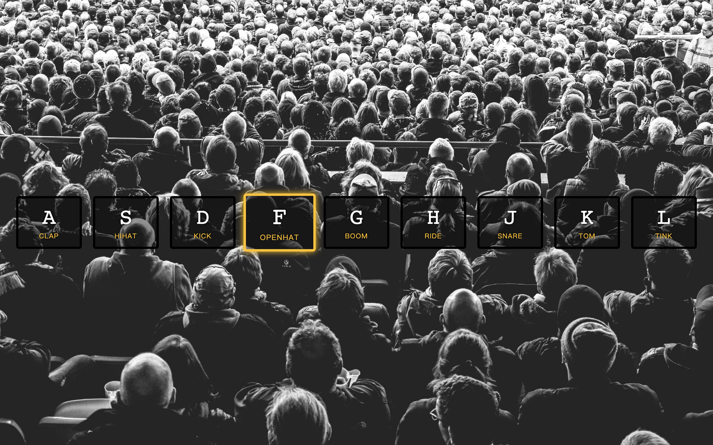
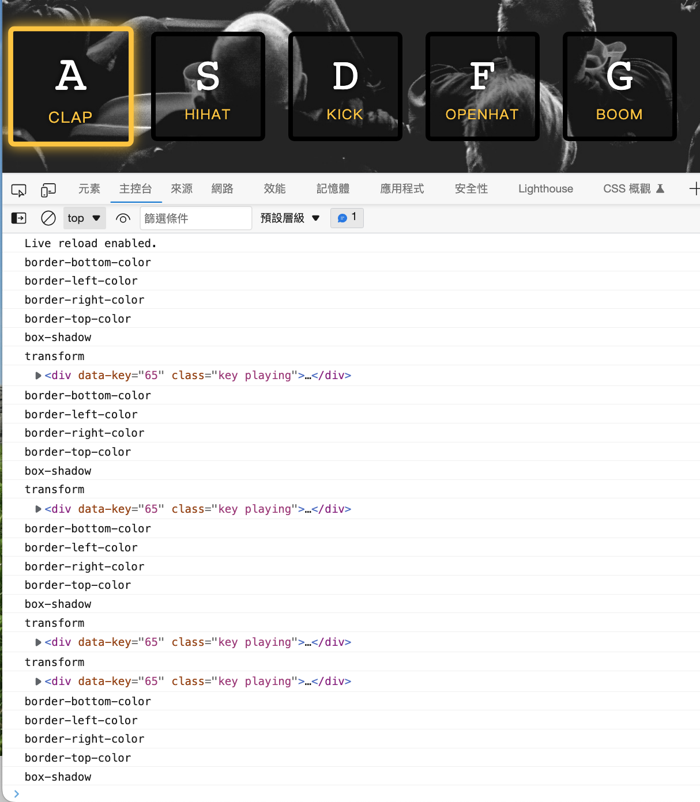

# 01_javascript-drum-kit



## :dart: [DEMO](https://ljbl22.github.io/JavaScript30/01_javascript-drum-kit/)


## :writing_hand: Highlights

- listen to **window** by the action "keydown"
- use **{keyCode}** to replace `event.keyCode`
- use 2 skills here:
 ```JavaScript
    (`.key[data-key="${keyCode}"]`)
  ```
  1. attribute selector (which I never thought can be used in DOM, but yes, why not?)
  2. literal template
  - [key code](https://www.toptal.com/developers/keycode) website
- video rewind from the beginning
  ```
  HTMLMediaElement.currentTime = 0
  ```
- listen to each key when 'the event' end. And `transitionend` is the event we are looking for.

### Codes
  ```JavaScript
  function playSound({ keyCode }) {
    const audio = document.querySelector(`audio[data-key="${keyCode}"]`);
    const key = document.querySelector(`.key[data-key="${keyCode}"]`);
    if (!audio) return;
    audio.currentTime = 0;
    audio.play(); //keep playing
    key.classList.add("playing"); //no need to add, because did not remove
  }

  function removeTransition({ propertyName }) {
    // use 3 console.log here to examine what's going on here...
    if (propertyName !== "transform") {
      console.log(propertyName);
      return;
    }
    console.log(propertyName);
    this.classList.remove("playing");
    console.log(this);
  }

  const keys = document.querySelectorAll(".key");
  keys.forEach((key) =>
    key.addEventListener("transitionend", removeTransition)
  );
  window.addEventListener("keydown", playSound);
  ``` 

## :question: A Question Regarding `if (propertyName !== "transform") return;`

### 1. Original purpose:

  ```CSS
  .key {
    border: 0.4rem solid black;
    /*...*/
    transition: all 0.07s ease;
  }

  .playing {
    transform: scale(1.1);
    border-color: #ffc600;
    box-shadow: 0 0 1rem #ffc600;
  }
  ```

- By setting up `"all"` here, when the class `"playing"` was added, transition applied to all the properties in `"playing"`, including four `border-color`, `transform` and `box-shadow`; which means all six properties will fire the `transitionend` event.

- In my understanding, Wes would like to prevent these six events from _lowering the performance_. (Please correct me if I am wrong.)

### 2. Problems

- Yet it causes a small problem, I noticed that when you hold the key for more than the transition time (which is 0.7s in this case), the class "playing" would never be removed. But if you remove the line `if (propertyName !== "transform") return;`, problem solved.

- Here is a [discussion](https://stackoverflow.com/questions/43794891/remove-class-on-keypress-after-key-hold-transitionend-weird-behavior) about this behavior. All three answers work.

  - by delete this line `if (propertyName !== "transform") return;`
  - by `setTimeout`
  - by adding `keyup` listener

- However, when I tried to explain why this line makes the `transition` event of `transform` never happen, which will never lead to the behavior of `transitionend` event, I could not find proper explanation to state this behavior. Every explanation just doesn't seem right.

- I also tried to `console.log()` to see what happen when holding the key.
   As you can see in the last two parts, I guess those are the key.

- I also checked MDN and see this note, yet I think in this case, once you hold the key over .7s, the later transition was not even start, so it was not related to the completion behavior.

  > Note: The transitionend event doesn't fire if the transition is aborted before the transition is completed because either the element is made display: none or the animating property's value is changed.

### 3. SO... 
I guess I have to leave this question here, and ask the universe for further solution. **Please PR me if you can explain this situation, many thanks!**

## :page_facing_up: reference and discussion

- discussion on [stackoverflow](https://stackoverflow.com/questions/43794891/remove-class-on-keypress-after-key-hold-transitionend-weird-behavior)

- transtionend was not fired [stackoverflow](https://stackoverflow.com/questions/17939290/for-javascript-or-jquery-how-to-make-transitionend-event-not-fire)

- [event reference](https://developer.mozilla.org/en-US/docs/Web/Events)
- [[css-transitions] why doesn't transitionend event fire in some cases?](https://github.com/w3c/csswg-drafts/issues/3043)
- transition [MDN](https://developer.mozilla.org/en-US/docs/Web/CSS/transition)
- Using CSS transition [MDN](https://developer.mozilla.org/en-US/docs/Web/CSS/CSS_Transitions/Using_CSS_transitions)
- it should be related useful in other cases (can not be neglected) [中文](https://medium.com/icguanyu/day5-flex-panels-d3ac7ba5b992)
- another JS30 #1 video in [Chinese](https://www.youtube.com/watch?v=f2ttaeDHzwE)
- ChatGPT's reply:
  > 因為這段程式碼是在檢查 propertyName 是否為 "transform"，如果不是，就會直接 return 並不會執行 this.classList.remove("playing");

  > 當你取消了這段程式碼後，不管 propertyName 是什麼，都會執行 this.classList.remove("playing");
  
  > 造成在原本的程式碼中，如果 propertyName 不是 "transform"，則函式會直接 return，不會執行 this.classList.remove("playing");，導致顏色不正常改變、class name "playing" 也無法正常加上或去除。
  
  > 這就是為什麼取消了這段程式碼後，transition 就都可以正常運作的原因。
