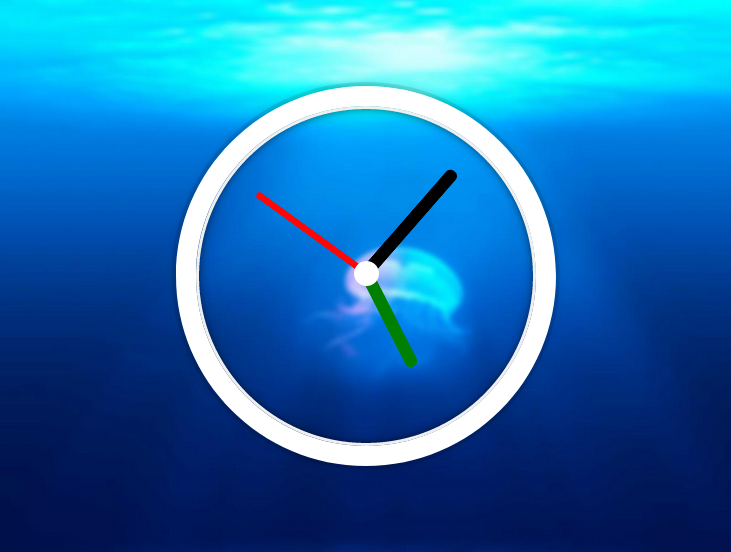
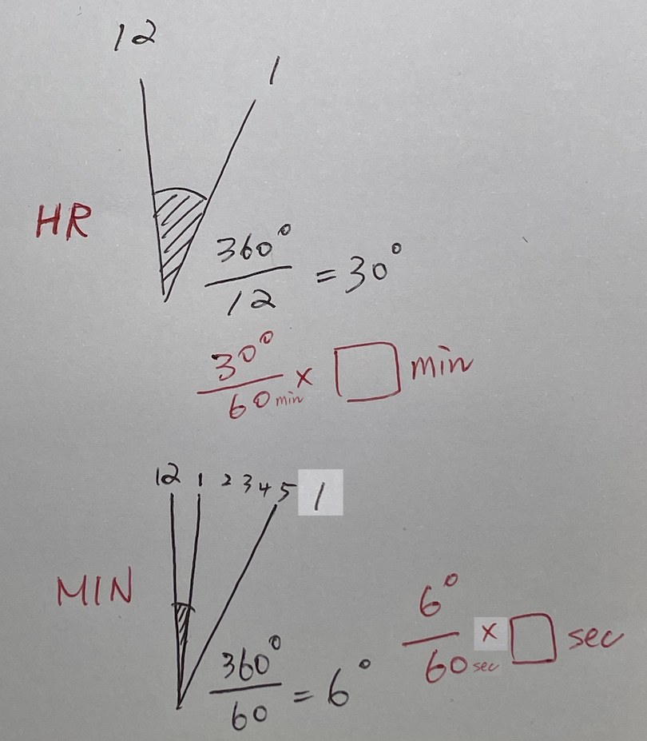

# 02 CSS + JS Clock :woman_juggling: [DEMO](https://ljbl22.github.io/JavaScript30/02_js-css-clock/)



### Codes

```JavaScript
      const secondHand = document.querySelector(".second-hand");
      const minHand = document.querySelector(".min-hand");
      const hourHand = document.querySelector(".hour-hand");
      
      function setClock() {
        const now = new Date();
        const seconds = now.getSeconds();
        const secondDegrees = (seconds / 60) * 360;
        secondHand.style.transform = `rotate(${secondDegrees}deg)`;
        // console.log(seconds);

        const mins = now.getMinutes();
        const minDegrees = (mins / 60) * 360 + (seconds / 60) * 6;
        minHand.style.transform = `rotate(${minDegrees}deg)`;

        const hours = now.getHours();
        const hourDegrees = (hours / 12) * 360 + (mins / 60) * 30;
        hourHand.style.transform = `rotate(${hourDegrees}deg)`;
      }
      
      setInterval(setClock, 1000);

      setClock();
```

## :writing_hand: Highlights

- **function constructor**: by using `new` (the operator) to create a inheritance function, the Function() constructor creates a new Function object.
- `Date()` related web API, including `getSeconds`, `getMinutes`, `getHours`
- in Wes Bos original codes, by using `.style.` to add css declaration via js.
- DOM API, Difference between `setInterval`, `setTimeout`, `Window.requestAnimationFrame()`:

```JavaScript
setClock() //initial code

setInterval(setClock, 1000)
//設定間隔，持續執行。repeatedly calls a function or executes a code snippet, with a fixed time delay between each call. 
```
```JavaScript
setClock() //initial code
setTimeout(timeoutHandler, 1000)
function timeoutHandler(){
 setClock()
 setTimeout(timeoutHandler, 1000)
}
//設定延遲，執行一次。sets a timer which executes a function or specified piece of code once the timer expires. 
//Only execute once, except you add a handelder function to repeat itself.
```
```JavaScript
window.requestAnimationFrame(animationHandler)
function animationHandler(){
 setClock()
 window.requestAnimationFrame(animationHandler)
}
//處理畫面更新的 setTimeout，不用指定時間，依據硬體(60hz/75hz...144hz)更新畫面。
//Similar to setTimout, but more focusing on the hardware repaint frequency.
//The window.requestAnimationFrame() method tells the browser that you wish to perform an animation and requests that the browser calls a specified function to update an animation before the next repaint._from MDN
```

- Regarding the weird bouncing effect: for the original Wes Bos codes, canceling the transition can solve the problem, or add more function, see [GuaHsu(中文)](https://github.com/guahsu/JavaScript30/tree/master/02_JS-and-CSS-Clock/). However, for me, instead, I prefer [Alex(中文)]((https://www.youtube.com/watch?v=O1YsB3qxO4g))'s way by adding pseudo class to modify different hands' style as well as make good use of the default `transform-origin: center` to keep it simple, and prevent from the 90 deg to 450 deg caueing a later jump back effect.
```CSS
      .clock-face:after {
        content: "";
        display: block;
        width: 25px;
        height: 25px;
        position: absolute;
        left: 50%;
        top: 50%;
        transform: translate(-50%, -50%);
        border-radius: 50%;
        background-color: #fff;
      }

      .hand {
        position: absolute;
        width: 100%;
        height: 100%;
      }

      .second-hand:after {
        position: absolute;
        content: "";
        display: block;
        width: 7px;
        height: 45%;
        border-radius: 1rem;
        background-color: #ff0505;
        left: 50%;
        bottom: 50%;
        transform: translate(-50%, 0);
      }
```      
- Regarding the addition degrees math, check this drawing:


## :page_facing_up: reference and discussion
- Window.requestAnimationFrame()[MDN](https://developer.mozilla.org/en-US/docs/Web/API/window/requestAnimationFrame)
- `transform-origin`[MDN](https://developer.mozilla.org/en-US/docs/web/css/transform-origin)
- [[ Alex 宅幹嘛 ] 👨‍💻 深入淺出 Javascript30 快速導覽：Day 2：CSS + JS Clock](https://www.youtube.com/watch?v=O1YsB3qxO4g)
- [HanaHina](https://codepen.io/hanahina/pen/yrPWaW)'s work: using border-width to create triangle hands, making time-pins.
