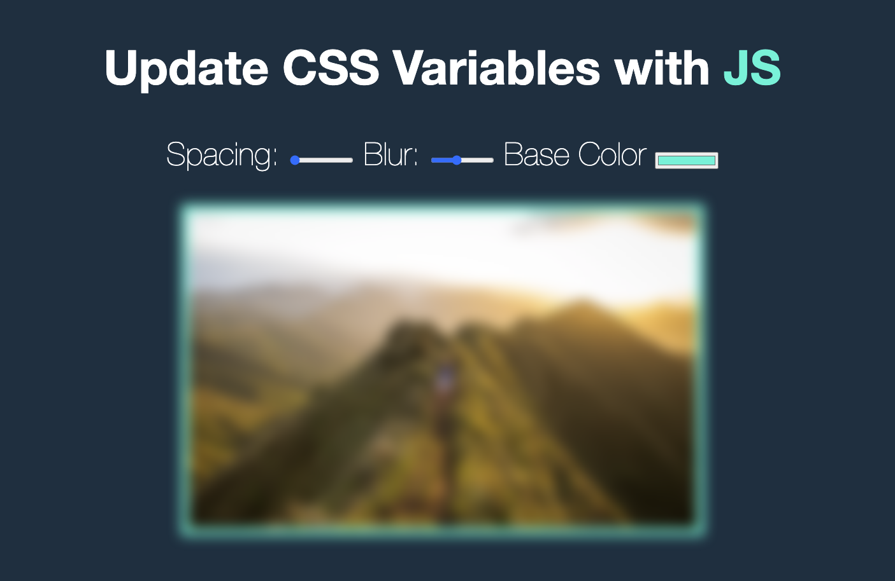
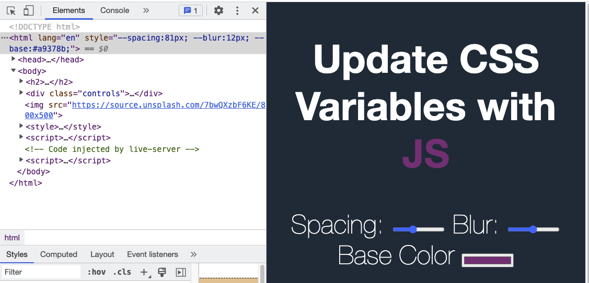

# 03 Playing with CSS Variables and JS: [DEMO](https://ljbl22.github.io/JavaScript30/03_css_variables/)



### Codes

```JavaScript
function handleUpdate() {
        const suffix = this.dataset.sizing || '';
        // name attributes
        // root => choose html element
        // element.style.setProperty
        // check devtool => add suffix
        document.documentElement.style.setProperty(
          `--${this.name}`,
          this.value + suffix
        );
      }
```

## :writing_hand: Highlights

- How to choose the `root` from [MDN](https://developer.mozilla.org/en-US/docs/Web/API/Document)

  > Document.documentElement Read only
  >
  > > Returns the Element that is a direct child of the document. For HTML documents, this is normally the HTMLHtmlElement object representing the document's <html> element.

- Directly use inline css to change the css variables



## :page_facing_up: reference and discussion

- dataset attribute: customize your own attribute, let DOM to use it.

- [MDN](https://developer.mozilla.org/en-US/docs/Web/API/Document)
